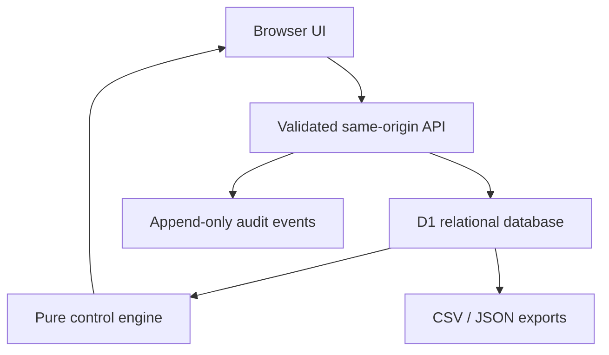

# Savannah Project Control

[Open the interactive demo](https://savannah-project-control-demo.matijamiletic.chatgpt.site)
·
[Give feedback](https://github.com/Matija-Miletic/Project-Control-System/issues/new)

Savannah Project Control is a browser-based construction control prototype for
labour productivity, programme exposure, materials, variations and data
quality. It keeps original allowances, approved changes, actuals and forecasts
separate and auditable.

This public repository contains fictional demonstration data only. It excludes
Savannah’s source workbooks, client programmes, live records, credentials and
private job data. The hosted demonstration is a shared sandbox: changes made by
one visitor may be visible to others or replaced during testing.

## What the system does

- Protects a fictional 1,825.9 h labour baseline.
- Adds approved variation allocations to a separate revised budget.
- Provides a full-project, day-level Gantt grid where man-days can be entered
  directly for any task and date. One man-day is currently 8.9 labour hours.
- Recalculates only the automatic working-day cells after each manual planning
  point, using the remaining task allowance and due date.
- Restores every projected date after today with a single guarded reset while
  retaining history, today, baselines and approved changes.
- Records daily labour hours and task-specific physical quantity; users never
  enter cumulative progress.
- Separates at-risk and rejected variation hours from approved-scope
  productivity.
- Calculates earned hours, productivity variance, forecast hours, required
  staff and forecast finish.
- Tracks target, forecast and confirmed procurement dates using a working-day
  calendar.
- Displays target and forecast overlays, crew heatmaps, selectable task groups,
  total daily demand and feasibility warnings on the programme.
- Collapses past weeks by default while keeping the current and future weeks
  visible; each past week and all past weeks can be toggled.
- Provides add, inspect, edit and confirmed-delete controls for every
  user-managed register. Register tables are collapsed by default.
- Provides contextual question-mark help with hover summaries and links to
  anchored guidance in a separate Help tab.
- Supports single-day and arbitrary date-range calendar exceptions.
- Runs reconciliation, programme, daily-input, procurement, variation and setup
  checks.
- Records every write and forecast reset in an append-only audit trail.
- Exports the current page as CSV or print/PDF and the complete project as a
  versioned JSON snapshot with audit history.

## User workflow

1. **Setup** – confirm the status date, target finish, working calendar,
   productive hours and forecast thresholds. Verify that imported task hours
   reconcile to the protected source total.
2. **Daily input** – once per task/date/workfront/variation combination, enter
   total labour hours and the physical quantity completed that day. The form
   displays the task’s unit of measure, such as m², lineal metres or each. Add a
   delay reason when hours produce no measured progress.
3. **Programme** – enter person-day allocations directly in the chart. Manual
   values stay fixed and later automatic weekdays redistribute the remaining
   task allowance to the due date. Weekend and exception-day fields remain
   available for deliberate work. Use heatmap, target/forecast overlays and
   demand views to test an allocation before committing it.
4. **Materials** – maintain lead time, buffer, target need, order, and confirmed
   delivery dates. “Off the shelf” is not treated as confirmed delivery.
5. **Variations** – register exposure first. Only an approved allocation changes
   the revised task budget.
6. **Checks** – resolve critical exceptions before issuing a report. Warnings
   require review; information items document explained conditions.
7. **Export** – export the active register/programme to CSV, print the current
   view to PDF, and take a master JSON backup at each reporting cycle or before
   a material setup change.

The UI includes short instructions beside each action, explicit status
feedback, keyboard focus styles, responsive layouts and print-safe summary
cards. The overview intentionally presents only the position and the highest
priority exceptions.

## Calculation contract

All formulas are implemented in the pure calculation module
`lib/engine.ts` and covered by automated tests.

For task \(i\):

```text
revised units       = original units + approved variation units
revised budget      = original budget hours + approved variation hours
budget h/unit       = revised budget / revised units
earned hours        = capped completed units × budget h/unit
productivity var.   = earned hours − approved-scope actual hours
forecast remaining  = remaining units × selected forecast h/unit
forecast total      = approved-scope actual + forecast remaining
forecast variance   = revised budget − forecast total
required staff      = forecast remaining /
                      remaining working days /
                      productive hours per person per day
```

Sign convention:

- positive productivity variance is favourable;
- positive forecast variance is within budget;
- a forecast finish after target is adverse.

Forecast rate selection:

1. a reasoned manual rate, when present;
2. actual-to-date hours per unit after either the percentage threshold or unit
   threshold is met;
3. the revised budget rate before sufficient progress exists.

The demo defaults are 10% or 3 equivalent units. A manual start/finish/rate is
stored independently.

### Programme allocation contract

The programme converts each task’s revised labour allowance into person-day
equivalents using the configured hours per man-day:

```text
task man-days          = ceil(revised budget hours / hours per man-day)
remaining man-days     = task man-days − fixed actual/manual man-days
automatic weekday load = remaining man-days /
                         remaining working days to the task due date
```

The control model plans in whole person-days, so the task total rounds up;
individual grid entries may be decimal values for practical allocation, for
example `0.5`. Each manual cell is a fixed planning point. Automatic cells to
its left are not rewritten, and cells to its right immediately redistribute
the then-remaining allowance. A manual `0` deliberately blocks that day.
Weekends and calendar exceptions are excluded from default projections but
remain editable.

“Reset future values” deletes manual programme cells strictly after today and
clears task forecast overrides. It then restores the default working-day
requirement. Historical cells, today, source and target dates, approved
changes, daily physical progress, calendar rules and audit history remain
intact.

## Architecture



| Layer | Responsibility |
| --- | --- |
| `app/` | Server-rendered shell, responsive workspaces and API routes |
| `lib/engine.ts` | Earned-hours, forecast, staffing and exception calculations |
| `lib/programme.ts` | Man-day grid, downstream allocation and reset-compatible programme state |
| `lib/date.ts` | UTC date-only and working-calendar arithmetic |
| `lib/control-state.ts` | Project-scoped reads, relation assembly and checks |
| `lib/seed.ts` | Idempotent installation of the fictional public demo |
| `db/schema.ts` | Relational source, target, actual, variation, material and audit model |
| `drizzle/` | Ordered database migrations packaged with each deployment |
| `worker/` | Cloudflare Worker entry and runtime bindings |

The application uses Vinext/React/TypeScript, Cloudflare D1 and Drizzle. Each
deployment is intended for one job. Project IDs still scope every operational
record so that accidental cross-project queries are structurally difficult.

## Data model and invariants

The three control layers never share a writable column:

- **Original** – imported costing hours and original programme dates.
- **Current approved target** – original plus approved variation allocations.
- **Current forecast** – actual progress, selected production rate and current
  constraints, with an optional reasoned override.

Important invariants:

- `tasks.original_budget_hours` is never changed by a forecast or management
  rate.
- Every approved variation hour/unit is allocated to a task.
- Daily-entry dedupe keys block duplicate task/date/workfront/variation rows.
- Completed units are capped for earned-hours calculation, but an overrun still
  creates a critical check.
- At-risk/rejected actuals remain visible but do not distort approved-scope
  productivity.
- Material order dates use lead time + buffer and the project’s non-working
  dates.
- Future programme reset is date-bounded, confirmation-gated and audit logged.
- Foreign keys restrict deleting tasks that own controlled history.
- Imported baseline tasks are protected; user-created tasks can be deleted once
  their controlled links are removed.

## Security and privacy

- The hosted public instance accepts anonymous changes to one shared fictional
  dataset so reviewers can exercise the workflows.
- Do not enter personal, confidential, client or operational project data into
  the public demo.
- A real job deployment must start private and restore authenticated write
  identity before operational use.
- POST requests reject cross-origin origins.
- Inputs are allowlisted, length bounded, number bounded and date validated on
  the server. Browser validation is only a convenience.
- All SQL writes use bound parameters.
- Error responses avoid database internals; detailed errors remain in Worker
  logs.
- Demo audit records use a fixed anonymous actor unless the host supplies an
  authenticated workspace identity.
- Hours-only display avoids unnecessary commercial values. Confidentiality
  still depends on access control, not hidden UI fields.

This design aligns with the intent of OWASP ASVS, the New Zealand Privacy Act
2020 security principle, WCAG 2.2 status/focus guidance, D1 foreign-key/index
guidance and standard earned-value/schedule-control practice.

## Failure modes and controls

| Failure mode | Preventive or recovery control |
| --- | --- |
| Duplicate daily line | Unique dedupe key; API returns a specific conflict |
| Hours without progress | Warning unless a delay reason explains the line |
| Progress without hours | Warning and correction prompt |
| Units above approved total | Earned hours capped; critical exception retained |
| Work recorded to inactive task | Server rejects on-hold/cancelled task |
| At-risk work corrupts base productivity | Separate variation status and actual-hours bucket |
| Approved VO not allocated | Reconciliation check blocks silent budget drift |
| Source hours drift | Exact task/source reconciliation against 1,825.9 h |
| Rate change rewrites hours | Imported hours are authoritative; rate is metadata |
| Insufficient progress distorts forecast | Budget rate remains until either threshold is met |
| No assigned crew | Explicit exception; finish is not falsely calculated |
| Required crew exceeds practical maximum | “Labour recovery not achievable” critical check |
| Finish after target | Critical programme exception |
| Unknown critical path | Explicit warning; never inferred from bar colour |
| Material not ordered by order date | Critical/warning based on material criticality |
| Confirmed delivery after need | Critical/warning and forecast constraint |
| Weekend/holiday date error | Date-only UTC arithmetic and project holiday table |
| Delay spans several days | One calendar exception accepts an inclusive start/end range |
| Manual forecast masks logic | Reason required; override visible and resettable |
| Manual grid entry rewrites prior plan | Allocation is calculated left-to-right; only later automatic cells redistribute |
| Allocation exceeds allowance | Row is marked over-allocated and excess person-days are shown |
| Reset erases history | Reset deletes only programme values after today and manual forecast overrides |
| Accidental register deletion | Row modal, explicit red action, confirmation, relationship checks and audit event |
| Hidden records become unmanageable | Every input page includes a default-collapsed register with row-level edit/delete controls |
| Ambiguous “unit” entry | Task-specific physical quantity label and UoM are displayed beside the input |
| Partial first-run seed | Idempotent `INSERT OR IGNORE` seed heals missing demo rows |
| Multi-statement seed interruption | Bounded D1 batches; later read retries missing rows |
| Database unavailable | No write is claimed; UI shows retry state |
| Concurrent duplicate write | Database unique constraint is authoritative |
| Cross-site mutation | Same-origin enforcement |
| Corrupt/partial export | Export generated from a completed state read and carries schema version |
| Deployment schema mismatch | Generated migrations are inspected, packaged and applied before app traffic |

## Programme limitations

The public dataset is a fictional demonstration, not a native logic-linked P6
or Microsoft Project schedule. Accordingly:

- criticality is `client-designated`, `manual` or `unknown`;
- the application never presents unknown criticality as calculated fact;
- Savannah day-level target/forecast control is operational;
- a native P6/MS Project/structured CSV import can populate
  `client_activities`, `programme_mappings` and `task_dependencies` later.

The demo intentionally includes a date variance between its 16 November 2026
summary finish and 6 November 2026 handover target so the exception workflow is
visible.

## Local development

Requirements:

- Node.js 22.13 or later
- Linux with `flock`, `curl` and GNU `timeout`

Commands:

```bash
npm run install:ci
npm run db:generate
npm run dev
npm test
npm run lint
npx tsc --noEmit
```

`npm run db:generate` is required after any `db/schema.ts` change. Inspect the
generated SQL before deployment, especially foreign-key actions and unique
indexes. Do not edit a migration that has already run in production; create a
new migration.

`npm test` performs the production build/artifact validation, then runs engine
and programme tests. The tests cover source reconciliation, approved versus
at-risk actuals, forecast thresholds, quantity capping, missing progress,
material constraints, working-day arithmetic, non-finite staffing protection,
default weekday distribution, downstream re-planning, manual zeroes,
weekend/exception behaviour, grid-to-actual conversion and over-allocation.

## Deployment and first run

The hosting manifest declares the D1 binding as `DB`. The deployment pipeline:

1. installs the locked dependencies;
2. builds the Vinext Worker;
3. validates the ESM Worker and hosting manifest;
4. packages `drizzle/` migrations;
5. applies pending migrations to the job database;
6. deploys the saved version.

On the first application read, `ensurePilotSeed()` installs the fictional demo
idempotently. For a real job, replace the seed/import process, restore
authenticated writes and deploy to a new private database. Never reuse this
public sandbox for operational records.

## Maintenance guidance

- Treat `lib/engine.ts` as a controlled accounting module. Change formula tests
  in the same commit as any formula change.
- Preserve date-only `YYYY-MM-DD` values; do not introduce local-time parsing.
- Add new variation statuses to the database, API allowlist and UI together.
- Add indexes for any new project-scoped filter or join used on every page.
- Keep audit writes in the same D1 batch as the controlled mutation where the
  operation already uses a batch.
- Never calculate criticality from visual overlap alone.
- Take a JSON export before a migration, bulk import or material setup change.
- Review Worker error logs after any failed write; the UI intentionally shows a
  non-sensitive message.
- Confirm backups can be parsed and carry the expected `schemaVersion`.

## Research basis

Architecture and controls were checked against:

- GAO Schedule Assessment Guide (continuous critical path and baseline/status
  discipline)
- PMI earned-value guidance
- Lean Construction Institute Last Planner System (plan reliability and reasons
  for variance)
- Procore field production report definitions for earned hours and projected
  completion
- Cloudflare D1 documentation for migrations, batches, foreign keys and indexes
- OWASP Application Security Verification Standard
- W3C WCAG 2.2
- New Zealand Privacy Act 2020, information privacy principle 5
- Employment New Zealand 2026 public holiday dates

The external references inform the control design. The public data is
fictional and does not reproduce a client programme or job allowance.
